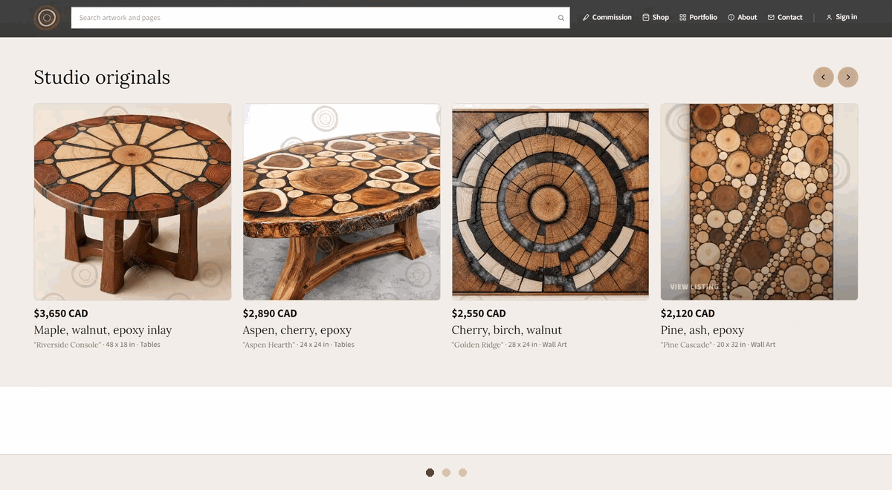
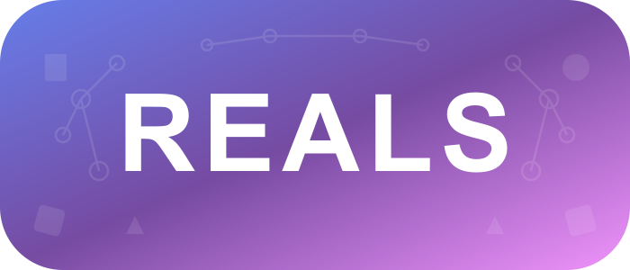
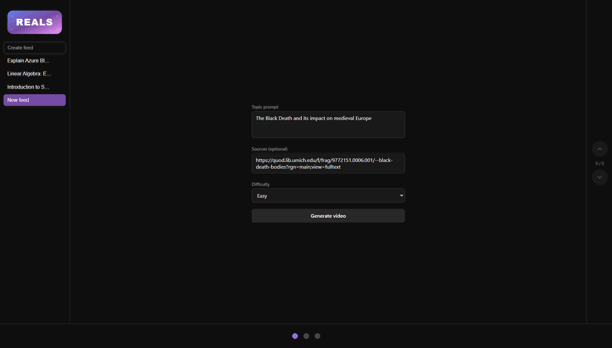
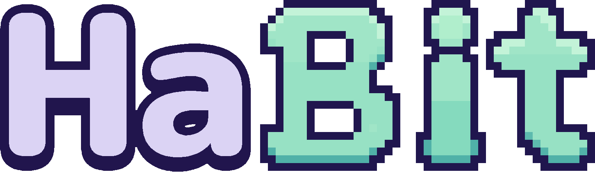
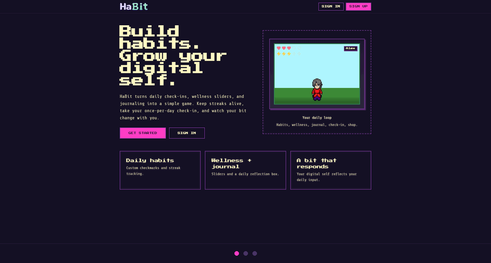

# Owen Price

Software Developer · SAIT · Calgary 
Open to junior developer roles in Calgary or remote

## About

I'm a software developer and a graduate of the **Object-Oriented Software Development** program at the **Southern Alberta Institute of Technology (SAIT)**. I have hands-on experience building full-stack, desktop and mobile applications.

At SAIT I worked with modern frameworks, relational databases, REST APIs and cloud deployment tools. Most of my projects were built in teams, so collaborating and coordinating work with other developers was a big part of the process.

I enjoy solving technical problems, designing clean systems and building complete applications, from the user interface to the data layer.

## Tech Stack

**Languages**

**Backend**

**Frontend**

**Data & Cloud**

**Also:** REST APIs · SQL Server · OpenAI · Groq · ElevenLabs

## Industry Projects

<h3>
  <picture>
    <source media="(prefers-color-scheme: dark)" srcset="assets/logos/sandra-dark.png" />
    
  </picture>
</h3>

**SAIT Software Development Capstone · Team JASON · May 22 – Aug 20, 2026** 
A full-stack portfolio, shop and commission platform for a Calgary-based wood mosaic artist.

  

**Overview:** Sandra needed one place to showcase her portfolio, sell finished pieces and take custom commission requests. We built a platform that does all three, plus an admin desk for managing listings, commissions and orders.

**Architecture:** Four Spring Boot services behind a Spring Cloud Gateway, each with its own PostgreSQL database, deployed through GitHub Actions to Dev, Staging and Prod environments on Azure.

**Outcome:** One of 84 capstone projects showcased at SAIT Tech CapCon 2026, and delivered to the client in August 2026 with an admin guide and handover package.

**My role:** Project management and frontend development on a five-person team, including the Next.js customer site and admin desk.

**Highlights**

- Stripe Checkout for shop purchases and commission payments
- Multi-step commission requests with reference image uploads
- Role-based access for customers, admins and super admins using JWT
- Customer accounts with order and commission history
- Live Instagram feed through the Instagram Graph API
- AI assistant in the admin desk and full SEO metadata

## Hackathon Projects

<h3></h3>

**CalgaryHacks · Feb 14 – 15, 2026** 
An educational web app that turns short-form video into an interactive learning experience.

  

**Overview:** Instead of fighting doom-scrolling, Reals redirects the format toward education. Users pick a topic and get short AI-generated lesson videos, each followed by a quiz they must pass before continuing.

**Architecture:** Groq writes each script and quiz, ElevenLabs turns the script into a voice-over and Sora generates the video. Media is stored in Azure Blob Storage, lesson and quiz data in MySQL, and everything is served through a Next.js frontend.

**My role:** Azure setup, Blob Storage integration and the Sora video generation pipeline.

**Highlights**

- Topic-based learning feed
- Fully AI-generated lessons, from script to voice-over to video
- Multiple-choice quiz required before the next video

---

<h3></h3>

**Cursor Calgary Hackathon - SAIT · May 23 – 24, 2026** 
A virtual pet-style habit and wellness app where the user becomes the pet.

  

**Overview:** Users build habits, complete daily wellness check-ins and write reflections while a pixel-art avatar responds to their progress. AI recommends personalized daily tasks based on their focus, check-ins and journal entries.

**Architecture:** A Next.js app with API routes for server-side logic and Supabase for the PostgreSQL database and authentication. Task recommendations come from an LLM through OpenRouter, Suno provides AI-generated music, and the app deploys to Vercel with GitHub Actions for CI/CD.

**My role:** UI, visual design, avatar presentation, dashboard screens and UX.

**Highlights**

- Custom daily habits and streaks
- AI-generated daily task recommendations
- Customizable pixel-art avatar with mood and health states
- Cosmetic shop and coin rewards

